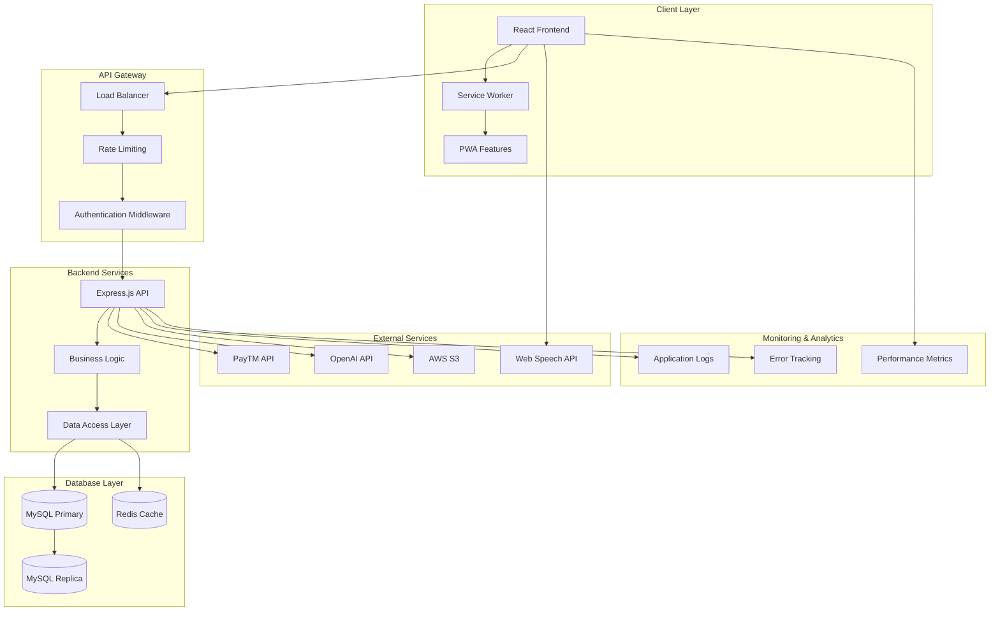
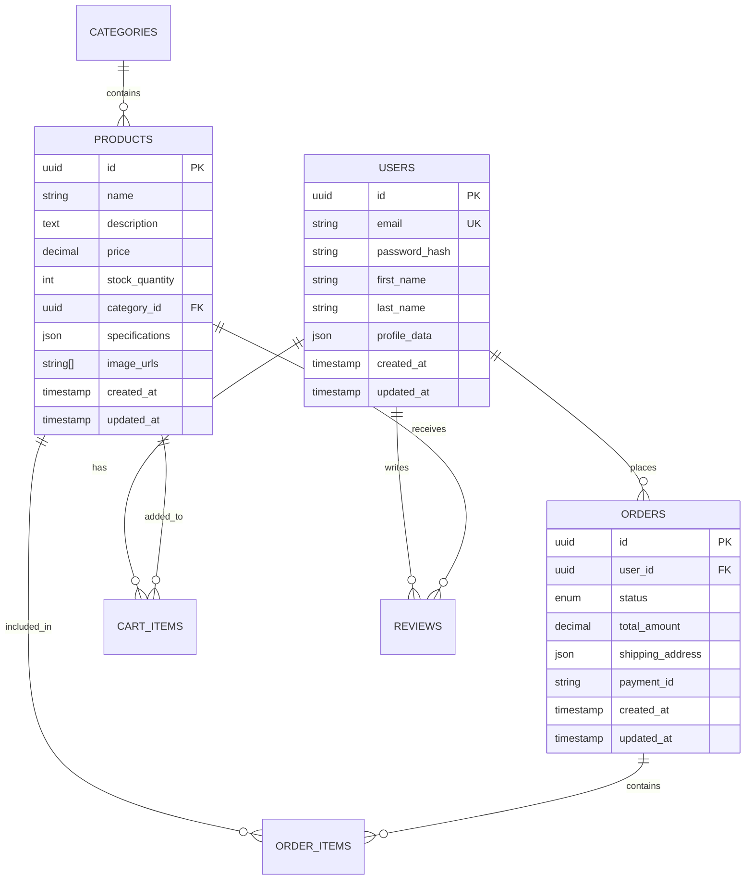

# 🏎️ F1 BOXXD
### *Premium Formula One E-Commerce Platform*

  <strong>Bridging the gap between Formula One passion and premium merchandise accessibility</strong>

  

---

## 📖 About The Project
 

**F1 Marketplace** is a cutting-edge e-commerce platform that revolutionizes the Formula One merchandise experience. Born from the passion of Formula One enthusiasts and the identified gap in quality F1 merchandise availability, particularly in Nepal and surrounding regions.

---

## ✨ Features

### 🛍️ **Core E-Commerce Features**

<table>
<tr>
<td align="center" width="33%">

**🛒 Smart Shopping Cart**
 
Real-time updates, persistent storage, quantity management, and seamless checkout flow

</td>
<td align="center" width="33%">

**👤 User Management**
 
Secure authentication, profile management, order history, and personalized experience

</td>
<td align="center" width="33%">

**📦 Product Catalog**
 
Dynamic filtering, search functionality, detailed product views, and category browsing

</td>
</tr>
</table>

### 🚀 **Advanced Features**

<table>
<tr>
<td align="center" width="25%">

**🎤 Voice Search**
 

 
Hands-free product search using Web Speech API

</td>
<td align="center" width="25%">

**💳 UPI Payments**
 

 
Secure UPI transactions with PayTM API

</td>
<td align="center" width="25%">

**🤖 AI Assistant**
 

 
Intelligent chatbot for customer support

</td>
<td align="center" width="25%">

**📱 Responsive Design**
 

 
Seamless experience across all devices

</td>
</tr>
</table>

---

## 🛠️ Technology Stack

### **Frontend Technologies**

  
  
  
  

### **Backend Technologies**

  
  
  
  

### **Integration & APIs**

  
  
  
  

### **DevOps & Deployment**

  
  

---

## 🏗️ System Architecture

### **High-Level Architecture**

### **Database Schema**

---
## 👥 Meet the Team

This project is a collaborative effort by students of the Department of Computer Science and Engineering, Kathmandu University.

| Name                         | Roll No. | GitHub Profile                                 |
|-----------------------------|:--------:|------------------------------------------------|
| Rishav Kumar Paudel[     |   35     | [Rishav](https://github.com/ScarFire111)                |
| Chuddant Shrestha       |   43     | [Chuddant](https://github.com/chuddantshrestha)              |
| Manjit Singh           |   47     | [Manjit](https://github.com/ManjitSingh121) |
| Subash Chandra Yadav    |   58     | [Subash](https://github.com/su-bash-np)                 |

